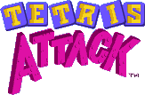

A browser-based re-implementation of the SNES puzzle classic **Tetris Attack**
(known in Japan as **Panel de Pon**): swap adjacent panels to line up 3+ of the
same color while the stack steadily rises.

> **Fan project — not affiliated with, endorsed by, or licensed by Nintendo.**
> _Tetris Attack_ / _Panel de Pon_, its characters, artwork, and logo are the
> property of Nintendo and Intelligent Systems. This is a non-commercial
> educational/hobby re-implementation. See **Credits & Attribution** below.

---

## Build & run

```
cd tetris-attack
npm install
npm run build      # webpack → dist/
npm run serve      # http-server dist -p 8000
# open http://localhost:8000
```

> Rebuild (`npm run build`) after editing anything under `src/` — the browser
> runs the bundled `dist/js/ta.js`, not the source files. For fast browser
> iteration, serve with caching off (`npx http-server dist -p 8000 -c-1`) or
> hard-reload (Ctrl+Shift+R), since `npm run serve` sets `max-age=3600`.

**Controls:** P1 = arrows / Space (swap) / Right-Shift (raise);
P2 (2P local) = WASD / G / H; pause = P, frame-step = F, quit-to-menu = Esc.

---

## Credits & Attribution

### Original game

- **Nintendo** and **Intelligent Systems** — _Tetris Attack_ (1996, SNES &
  Game Boy), originally released in Japan as _Panel de Pon_ (1995). All original
  gameplay, characters, music, the _Tetris Attack_ logo, and the source artwork
  the backgrounds were derived from are © **Nintendo / Intelligent Systems**.
  Used here for a non-commercial fan re-implementation.

### Art assets

- **spriterlicious** — SNES **stage-clear background** sprite rips
  (`src/assets/stageBackgrounds.png`: Yoshi/forest, sky, jungle, lilypad, cave, and
  night-moon stages), used behind the playfields. The underlying artwork remains
  © Nintendo; please credit **both spriterlicious and Nintendo** wherever these
  backgrounds appear.
- **Angelglory** — SNES **VS-mode character** sprite rips
  (`src/assets/vs_char_sprites.png`: Yoshi, Lakitu, Bumpty, Poochy, Flying Wiggler, Froggy,
  Gargantua Blargg, Lunge Fish, Raphael Raven, Hookbill, Naval Piranha, Kamek,
  Bowser), for the character-select screen. The characters and art remain
  © Nintendo / Intelligent Systems; credit **both Angelglory and Nintendo**.
- **Zeek** — SNES **Yoshi** sprite rip (`src/assets/yoshi_little_yoshi.png`), a full
  sheet covering the menu, title, overworld, in-game, stage-clear and ending Yoshi
  poses plus the orange **Little Yoshi**. The Little Yoshi idle frame stands in the
  bottom-right corner of the forest stage, where the SNES gameplay screens put him
  and the stage-clear backgrounds leave him out. The sheet asks to "give credit
  where credit is due"; Yoshi and the artwork remain © Nintendo, so credit
  **both Zeek and Nintendo**.
- **Parakarry** (aka **toastypk**), via MFGG — the SNES **font sheet**
  (`src/assets/font.png`), which carries three fonts; the small 8×6 HUD font is
  used for the in-game TIME and SCORE readouts, so this rip is on screen in every
  frame of a match. The rip asks only that the sheets not be passed off as one's
  own ("no credit is needed, but it would be nice if you did") — credited gladly.
  Art © Nintendo / Intelligent Systems.
- **JigglypuffGirl** — the SNES **VS-mode GAME OVER screen** rip
  (`src/assets/gameover.png`: the 256×224 background with the GAME OVER logo, the
  defeated-Yoshi sprites, and the TRY AGAIN? / YES / NO prompts), used for the
  results screen. The rip is marked "Credit?: Yes / Free Use?: Yes". Art
  © Nintendo / Intelligent Systems.
- **thewolfbunny** — SNES **stage-clear results box** sprite rip
  (`src/assets/score-stage-clear.png`). Note this is the end-of-stage results
  panel, _not_ the in-game score readout; it is currently unused, kept for a
  future results screen. Art © Nintendo / Intelligent Systems
  ("credit: feel free").
- **Nintendo** — the _Tetris Attack_ SNES title logo (`src/assets/logo.png`), used on
  the start menu.
- Combo/chain/trash/panel sprites (`src/assets/*.png`) ship with the base
  panel-de-js project (see Code lineage below).
- Custom social-media-logo block sprites created by **Tijmen Zwaan**
  ([tzwaan](https://github.com/tzwaan)) are also included, available as an
  optional alternate skin.

Every sprite rip above is a rip of **Nintendo / Intelligent Systems** artwork. The
rippers are credited for the work of extracting and cleaning the sheets; the
underlying art is not theirs to license, and neither is it ours. Credit both.

### Audio assets

- **SpcAran** (contributor: **Aran**), via
  [The Spriters Resource](https://sounds.spriters-resource.com/snes/tetrisattack/asset/443930/)
  — the SNES **general sound effects** ("General Sounds", Tetris Attack,
  Miscellaneous, submitted 1 January 2024). `src/assets/sfx/` holds the twelve
  clips this game actually uses: panel swap, pop, combo, chain, big chain, the
  danger warning, win, lose, menu move/confirm/cancel, and pause.
- **Deezer**, via
  [The Mushroom Kingdom](https://themushroomkingdom.net/media/ta-snes/wav)
  — the SNES **character voice clips** (`src/assets/char_sfx/`), one for each of
  the thirteen characters, played when you confirm your pick on the character-
  select screen.
- **Ragnarok, Datschge, YK, nensondubois** (rippers) and **TheAlmightyGuru**
  (recorder), via
  [VGMPF](<https://www.vgmpf.com/Wiki/index.php/Tetris_Attack_(SNES)>)
  — the SNES **music** (`src/assets/ost/`). Three tracks are in use: the Yoshi
  stage theme during play, "Demo Danger" while a player's stack is in the red,
  and the Game Over theme on the results screen.
- The music itself is by **Masaya Kuzume** (composer, sound program and sound
  effects), with **Yuka Tsujiyoko** as assistant composer and original Yoshi
  music by **Koji Kondo**; sound system program by **Kenichi Nishimaki**.
- All three sets are rips of **Nintendo / Intelligent Systems** audio. As with
  the art above, the rippers and submitters are credited for extracting the
  files; the underlying music and sounds remain
  © Nintendo / Intelligent Systems.

### Code lineage

Credits
<https://github.com/Zingler> ([panel-de-js](https://github.com/Zingler/panel-de-js))
<https://github.com/tzwaan> ([tetris-attack-js](https://github.com/tzwaan/tetris-attack-js))
<https://github.com/loociano> ([tetris-attack-ai](https://github.com/loociano/tetris-attack-ai))

---

_Tetris® is a registered trademark of The Tetris Company. This project is an
unofficial fan work and is not associated with The Tetris Company, Nintendo, or
Intelligent Systems._
